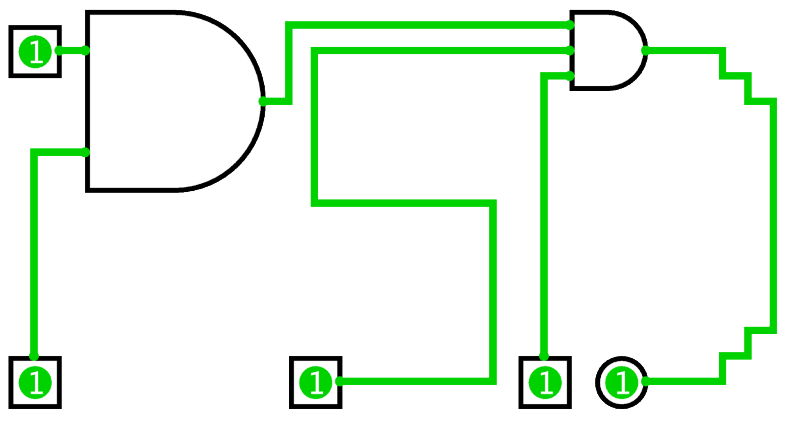
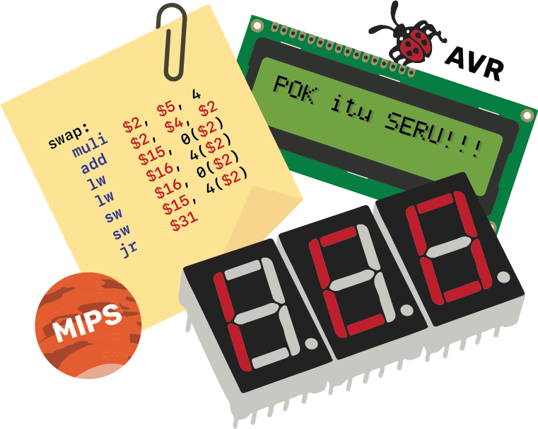

 

 

## Teaching Assistant
<table style="border-style:dotted;">
    <tr>
         <td> 
            

                
            

        </td>
        <td>
            <b> CSCM601150 - Introduction to Digital Systems </b>
            
 2023-2024 Odd Semester 

            
 ⭐️ Coordinator 

        </td>
    </tr>
    <tr>
        <td> 
            

                
            

        </td>
        <td>
            <b> CSCM601252 - Introduction to Computer Organization </b> 
            
 2023-2024 Even Semester 

            
 ⭐️ Coordinator 

        </td>
    </tr>
</table>

<!--
**Akmal76/Akmal76** is a ✨ _special_ ✨ repository because its `README.md` (this file) appears on your GitHub profile.

Here are some ideas to get you started:

- 🔭 I’m currently working on ...
- 🌱 I’m currently learning ...
- 👯 I’m looking to collaborate on ...
- 🤔 I’m looking for help with ...
- 💬 Ask me about ...
- 📫 How to reach me: ...
- 😄 Pronouns: ...
- ⚡ Fun fact: ...
-->
